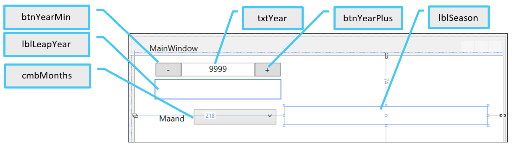

# Oefening 2  
## Selecties  
## Jaren & seizoenen  
  
    
De controls :  
  
  
  * Bij het opstarten  
    * moet txtYear gevuld worden met het huidige kalenderjaar.  
      lblLeapYear (= schrikkeljaar) dient gevuld te worden met de melding of het jaar al dan niet een schrikkeljaar is (zie verder)  
    * Moet cmbMonths gevuld worden met de 12 maanden van het jaar (deze code krijg je al)  

  * Maak een methode die berekent of het ingevoerde jaartal een schrikkeljaar is of niet.  
    Een jaar is een schrikkeljaar wanneer :  
    * Dat jaar deelbaar is door 4  
    * Tenzij het deelbaar is door 100, met uitzondering van de jaren die deelbaar zijn door 400 (die dan wel weer een schrikkeljaar zijn).  
    
> 2019 is geen schrikkeljaar  
> 2020 is wel schrikkeljaar  
> 2100 is geen schrikkeljaar  
> 2000 is wel schrikkeljaar  

Gebruik hier geneste if … else … voor   
  * Wanneer op btnYearMin wordt geklikt moet het jaartal met 1 worden verlaagd en dient lblLeapYear aangepast te worden.  
  * Wanneer op btnYearPlus wordt geklikt moet het jaartal met 1 worden verhoogd en dient lblLeapYear aangepast te worden.  
  * Wanneer de gebruiker zelf het jaartal verandert in txtYear, dan dient lblLeapYear ook aangepast te worden.  

> **TIP**  
>   * De gebruiker kan natuurlijk om het even wat in het tekstvak invoeren.  Gebruik hier dus de int.TryParse methode  
>   * Het TextChanged event van een texbox wordt al getriggerd van zodra je window opstart wat een exception zal opleveren.  Plaats de code van deze event handler binnen volgende selectie :  
>  
>  if (txtYear.IsLoaded)  
>   {  
>        …  
>   }  

  * Wanneer in cmbMonths een maand geselecteerd wordt, dan dient in lblSeason het seizoen waarbinnen deze maand valt te verschijnen (zie voorbeeld bovenaan).  
    We gebruiken gemakshalve de meteorologische seizoenen :   
    * Lente = maart, april, mei  
    * Zomer = juni, juli, augustus  
    * Herfst = september, oktober, november  
    * Winter = december, januari, februari  

    Denk zelf eens na hoe je dit zo eenvoudig mogelijk kunt oplossen (werk m.a.w. niet met vergelijkingen van de maandnamen)  
    Gebruik voor deze oefening de if … else if … else if … else …  

